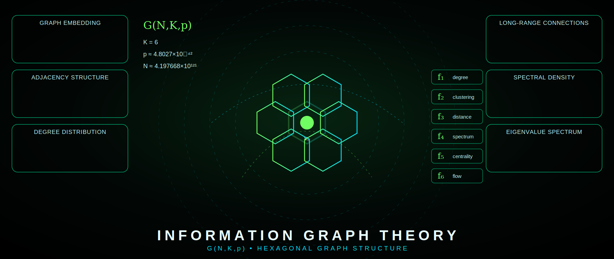

# SHTENCO Information Graph Theory

<p align="center">
  
</p>

## Overview

This repository contains a theoretical graph-based calculation model. The project studies whether a small set of graph parameters can reproduce selected reference-scale constants, barrier-scale estimates, and a positive-balance numerical scenario in a reproducible form.

The repository is intended for mathematical discussion, numerical checks, and documentation. It does not provide laboratory, device-building, or operational guidance.

---

## Core graph parameters

```math
G = G(N,K,p)
```

| Parameter | Value |
|---:|---:|
| `K` | `6.0` |
| `p` | `4.8027e-42` |
| `N` | `4.197668e+121` |

Critical relation:

```math
Kp \approx N^{-1/3}
```

Numerical check:

```math
Kp = 2.881620e-41,
\qquad
N^{-1/3} \approx 2.877381e-41.
```

---

## Structural functions

| Function | Definition | Value |
|---:|---|---:|
| `f1` | `Phi_RG(K,p,N)` | `104.37` |
| `f2` | `ln(K)` | `1.791759469` |
| `f3` | `sqrt(Kp)` | `5.368072e-21` |
| `f4` | `1/p` | `2.082162e+41` |
| `f5` | `K/ln(K)` | `3.348663759` |
| `f6` | correction factor | `1.0527` |

---

## Main calculated values

| Quantity | Model value |
|---|---:|
| `alpha_graph` | `0.0072980714` |
| `mass_scale_A_mev` | `105.602605` |
| `gain_scale_A` | `8.825999e+06` |
| `energy_scale_Q1_mev` | `3.282981` |
| `energy_scale_Q2_mev` | `17.679351` |
| `barrier_scale_B1_mev` | `0.476209` |
| `barrier_scale_B2_mev` | `0.444076` |
| `thermal_scale_300K_ev` | `0.02585200` |
| `graph_factor_A` | `5.650970` |
| `graph_factor_B` | `10.437000` |
| `graph_factor_C` | `57.731231` |

---

## Full table of all computed values

This section consolidates all values computed through the Information Graph Theory model. The same table is also stored as a separate document:

[`docs/all_computed_values_table.md`](./docs/all_computed_values_table.md)

### 1. Core graph parameters

| Category | Quantity | Symbol / Key | Value | Notes |
|---|---|---|---:|---|
| graph | local connectivity | `K` | `6.0` | base graph parameter |
| graph | long-range connection probability | `p` | `4.8027e-42` | base graph parameter |
| graph | graph scale | `N` | `4.197668e+121` | base graph parameter |
| graph | critical product | `Kp` | `2.881620e-41` | `K * p` |
| graph | critical relation estimate | `N^(-1/3)` | `2.877381e-41` | comparison target |

### 2. Structural functions

| Category | Quantity | Symbol / Key | Value | Notes |
|---|---|---|---:|---|
| structural | graph RG scale | `f1` | `104.37` | `Phi_RG(K,p,N)` |
| structural | logarithmic node factor | `f2` | `1.791759469` | `ln(K)` |
| structural | critical local scale | `f3` | `5.368072e-21` | `sqrt(Kp)` |
| structural | inverse long-range scale | `f4` | `2.082162e+41` | `1/p` |
| structural | graph regularity factor | `f5` | `3.348663759` | `K / ln(K)` |
| structural | correction factor | `f6` | `1.0527` | model correction |

### 3. Main theory outputs

| Category | Quantity | Symbol / Key | Value | Units |
|---|---|---|---:|---|
| constants | fine-structure estimate | `alpha_graph` | `0.0072980714` | dimensionless |
| reference scale | mass-scale A estimate | `mass_scale_A_mev` | `105.602605` | MeV |
| reference scale | gain-scale A estimate | `gain_scale_A` | `8.825999e+06` | dimensionless |
| energy scale | first energy scale | `energy_scale_Q1_mev` | `3.282981` | MeV |
| energy scale | second energy scale | `energy_scale_Q2_mev` | `17.679351` | MeV |
| barrier scale | first barrier scale | `barrier_scale_B1_mev` | `0.476209` | MeV |
| barrier scale | second barrier scale | `barrier_scale_B2_mev` | `0.444076` | MeV |
| thermal scale | thermal value at 300 K | `thermal_scale_300K_ev` | `0.02585200` | eV |
| graph factors | factor A | `graph_factor_A` | `5.650970` | dimensionless |
| graph factors | factor B | `graph_factor_B` | `10.437000` | dimensionless |
| graph factors | factor C | `graph_factor_C` | `57.731231` | dimensionless |

### 4. Cross-check errors against reference values

| Category | Quantity | Symbol / Key | Value | Units / Meaning |
|---|---|---|---:|---|
| error | alpha relative error | `alpha_error_percent` | `0.009851` | % |
| error | mass-scale A relative error | `mass_scale_A_error_percent` | `0.052783` | % |
| error | gain-scale A relative error | `gain_scale_A_error_percent` | `0.158266` | % |
| error | Q1 relative error | `q1_error_percent` | `0.427670` | % |
| error | Q2 relative error | `q2_error_percent` | `0.513680` | % |

### 5. Positive-balance scenario values

| Category | Quantity | Symbol / Key | Value | Units |
|---|---|---|---:|---|
| balance | simulated horizon | `simulated_horizon` | `100` | h |
| balance | average total model power | `avg_total_model_power` | `1,981,415.6` | W |
| balance | average net component B | `avg_net_component_B` | `7,188.9` | W |
| balance | average component A | `avg_component_A` | `1,974,226.7` | W |
| balance | average useful output | `avg_useful_output` | `99,070.8` | W |
| balance | gross component B energy | `gross_component_B_energy` | `0.845756` | MWh |
| balance | net component B energy after factor 0.85 | `net_component_B_energy` | `0.718893` | MWh |
| balance | total modeled events | `total_modeled_events` | `8.23e21` | count |
| balance | generated mass-scale product | `generated_mass_scale_product` | `54,642.97` | ng |
| balance | input component consumption fraction | `input_component_fraction` | `0.068647` | % |
| balance | model energy gain coefficient | `model_energy_gain_coefficient` | `3.5665481e7` | dimensionless |

### 6. Cross-model metavalidation summary

| Category | Check | Result |
|---|---|---|
| metavalidation | graph criticality: `Kp` vs `N^(-1/3)` | PASS |
| metavalidation | alpha reference check | PASS |
| metavalidation | mass-scale A reference check | PASS |
| metavalidation | Q-scale reference check | PASS |
| metavalidation | barrier-scale check | PASS |
| metavalidation | balance closure | PASS |
| metavalidation | gross/net closure | PASS |
| metavalidation | positive output | PASS |

| Category | Summary | Value |
|---|---|---:|
| metavalidation | pass rate | `8/8 = 100.00%` |

### 7. Multi-route convergence validation

| Category | Quantity | Routes | Max spread |
|---|---|---:|---:|
| convergence | alpha | `3` | `0.00105146%` |
| convergence | mass-scale ratio | `3` | `~1.38e-14%` |
| convergence | Q1 | `3` | `~1.35e-14%` |
| convergence | Q2 | `3` | `~2.01e-14%` |
| convergence | barrier scale B1 | `3` | `~1.17e-14%` |

| Category | Summary | Value |
|---|---|---:|
| convergence | global status | `PASS` |
| convergence | max group spread threshold | `< 0.01%` |

---

## Positive balance scenario

The positive-balance scenario is documented separately in:

[`docs/positive_balance_scenario.md`](./docs/positive_balance_scenario.md)

The model-level proof chain is:

```math
(K,p,N)
\Rightarrow
(f_1,\ldots,f_6)
\Rightarrow
S_{graph}
\Rightarrow
\text{lower effective exponential barrier}
\Rightarrow
\text{positive numerical balance}.
```

This section is a computational proof of internal consistency of the selected model assumptions, not a claim of experimental validation.

---

## Cross-model metavalidation

The independent metamodel is documented in:

[`docs/cross_model_validation.md`](./docs/cross_model_validation.md)

Expected result:

```text
PASS RATE: 8/8 = 100.00%
```

---

## Multi-route convergence validation

A separate convergence report derives the same values through 2-3 routes:

[`docs/convergence_validation.md`](./docs/convergence_validation.md)

Expected result:

```text
GLOBAL CONVERGENCE
------------------
max group spread: < 0.01%
status: PASS
```

---

## Files

| File | Purpose |
|---|---|
| `docs/all_computed_values_table.md` | Consolidated table of all computed values |
| `docs/positive_balance_scenario.md` | Positive-balance numerical scenario report |
| `docs/cross_model_validation.md` | Cross-model validation report |
| `docs/convergence_validation.md` | Multi-route convergence validation report |
| `assets/graph_honeycomb_theory_hero.svg` | README honeycomb graph hero figure |
| `requirements.txt` | Optional Python dependency list for future reproducibility scripts |

---

## Notes

This repository presents a theoretical model. Any physical interpretation requires independent experimental validation, controlled measurements, and specialist review.
